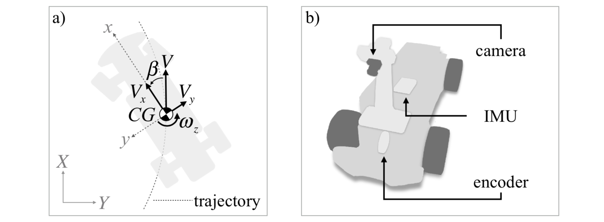

# Mixed Kinematics and Camera Based Vehicle Dynamic Sideslip Estimation for an RC Scaled Model

_This paper, written by Conno Kuyt and Matteo Corno, has been published and presentaed at the 2018 IEEE Conference on Control Technology and Applications (CCTA) Copenhagen, Denmark, August 21-24, 2018._

https://ieeexplore.ieee.org/abstract/document/8511487

## Abstract

Vehicle side slip angle is at the basis of many vehicle dynamics control systems. Many methods are available to estimate side-slip angle using on board sensors (usually accelerometers and gyros). The technical advances pertaining autonomous vehicles made an additional kind of sensor available: cameras. This study develops a mixed kinematic vision-based side slip angle estimation. The proposed algorithm merges the information of a commercial grade inertial measurement system, wheel encoders and information from a camera. The camera measurement are integrated in a Kalman filter observer. The paper implements and tests the approach on an instrumented RC scale vehicle, comparing the proposed approach against a kinematic based estimation. Experimental results show a decrease of a factor between 2 and 10 (depending on the type of maneuver) of the estimation mean squared error.

## Introduction

To improve traffic and vehicle safety and reduce related casualties, control systems are constantly being developed to assist drivers. These developments have been moving towards full vehicle control automation.  One of the challenges is to maximize the operational regime of the control systems to be on the edge or even outside of the stable envelope of the tires to be able to avoid accidents in extreme emergency situations. As a vehicle moves outside of the stable envelope the tires lose grip and start slipping, known as _drift motion_. Analyses of drift motion led to a better understanding of both the dynamics as well as its potential practical use in vehicle dynamic control design. Studies on race driver behavior inspired novel design approaches for automated drift controllers. The control objectives of the studies on automated drift control included the stabilisation of the vehicle at a reference sideslip angle. The experimental setups in these studies used a state estimator that relies on external and costly on-board sensors such as differential GPS. This approach to estimation is not feasible in an automotive industry standard production setting. 

Sideslip estimation based on _stock_ sensors (low-cost industry standard sensors) is a widely investigated topic. Examples of these sensors are wheel angular velocity encoders, steering angle encoders, IMU's and (low-cost) GPS receivers. There are mainly two general approaches to side slip angle estimation: black-box and physical-based approaches. The black-box approach is based on data driven models, such as neural networks. Physical-based  approaches are instead based of first principle models. These can be further classified in kinematic and dynamic models. Kinematic approaches rely on a simple vehicle model description that correlates basic kinematic quantities. These models are independent from specific parameters (such as tyre parameters) but suffer from a lack of observability for small yaw rates. Dynamic approaches include knowledge of the vehicle  and tyre parameters. They solve the issue of observability at the cost of a greater modelization effort. 

Most of the approaches in the literature employ standard inertial or mechanical sensors (encoders). Recently, thanks to the introduction of advanced driver assistance systems (ADAS) cameras have become standard sensors in cars. Currently, cameras are mainly used to detect other road users and obstacles in sufficient detail to make tactical decisions. However, the data coming from the cameras can  be used to extract motion information to support sideslip estimation.

This paper proposes a side slip estimation algorithm that fuses the information from classical sensors with the information provided by a camera. Starting from the approach of  
[Selmanaj et al. 2017](https://www.sciencedirect.com/science/article/abs/pii/S0967066117301491), the proposed Kalman filter fuses the information processed by a computer vision algorithm with a kinematic based side slip angle estimation. The algorithm is developed for an RC model car  (see the above figure) equipped with an 3 DoF Inertial Measurement Unit, wheel axle encoders, and a mono-camera. 

Other authors have investigated the same problem. In particular, [Botha et al. 2016](http://proceedings.asmedigitalcollection.asme.org/proceeding.aspx?articleid=2591696) develops a method based on a stereo camera; [Harchut et al. 2009](http://proceedings.asmedigitalcollection.asme.org/proceeding.aspx?articleid=1648272) employs a mono-camera and, similarly to our contribution, uses colored objects placed on the road to estimate sideslip angle. However the cited approach only uses the information from the camera and no sensor fusion is carried out. Finally, [Wang et al. 2012](https://ieeexplore.ieee.org/document/6548052) run a fusion algorithm that however requires information on the vehicle dynamic model (namely cornering stiffness). Differently from the previous contributions on the subject matter, the approach employed in this paper uses a mono camera and runs a kinematic-based sensor fusion. 

The paper is structured as follows: Section 1 discusses the basic rationale of the algorithm. Section 2 details the algorithm implementation. The focus of this contribution is on the sensor fusion approach, and not the computer vision algorithm for which a standard approach in the literature is employed.  Section 3 describes the experimental setup that is then employed in Section 4 for the final validation. 

(setf comment-continue " ")
(setf comment-style 'multi-line)
<!--

## Section 1: Eestimation Algorithm

This section explains the side slip angle (beta) estimation algorithm. To estimate beta, one essentially needs to estimate the longitudinal and lateral velocity in the body reference frame: 

\begin{equation}\label{eq:x}
x = {\left[ {\begin{array}{*{20}{c}}{{V_x}}&{{V_y}}\end{array}} \right]^T}.
\end{equation}
%%%%%%%%%%%%%%%%%%%%
using available sensors. 
\begin{figure}[thpb]
\centering
\adjustbox{trim={0} {0pt} {0} {45pt},clip}
{\includegraphics[width=\columnwidth]{figures/quantities}}
\caption{Summary of the available sensors measured quantities put out by the sensor suite.}
\label{fig:quantities}
\end{figure}
%%%%%%%%%%%%%%%%%%%%
Figure \ref{fig:quantities} outlines the sensors available for estimation:
\begin{itemize}
\item Planar accelerations measured at the center of gravity: $a_x$, $a_y$.
\item Yaw angular rate $\omega_z$.
\item The average front axle velocity $V_{\delta}$. 
\item The steering angle $\delta$.
\item The camera feed over a given Field of View (FoV). The Computer Vision Algorithm tracks $N$ feature points on the ground. As it will become clear, for each tracked point $q_n$, its distance from $CG$ ($x_n$,$y_n$), as well as its relative velocity components (in the camera reference) ($V_{xn}$,$V_{yn}$) [ m s$^{-1}$ ] are calculated.
\end{itemize}

The relation between the available measurements is captured by series of kinematic equations. Equation \eqref{eq:encoder} describes the relation between the front wheels velocity  and the inertial measurements.
%%%%%%%%%%%%%%%%%%%%%%%%%%%
\begin{align} 
{V_{\delta}} & =  \label{eq:encoder}  \\
& \sqrt {V_x^2 + {{\left( {{V_y} - {l_f}{\omega _z}} \right)}^2}}  \cos \left( {{{\tan }^{ - 1}}\left( {\frac{{\left( {{V_y} - {l_f}{\omega _z}} \right)}}{{{V_x}}}} \right) - \delta } \right)
 \nonumber
\end{align}
In the above equation, $l_f$ is the distance between the center of gravity and the front axle. The equation assumes that the wheels are not being braked nor accelerated and thus their longitudinal slip is negligible.

Equation \eqref{eq:IMU} describes the measured accelerations as a function of the system state:
\begin{equation}
\begin{array}{l}
{a_x} = {\dot V_x} - {\omega _z}{V_y} \\
{a_y} = {\dot V_y} + {\omega _z}{V_x}.
\end{array}
\label{eq:IMU}
\end{equation}

Finally, \eqref{eq:CVA} describes the velocity of the tracked features in the camera reference as a function of the vehicle state:
\begin{equation}
\begin{array}{l}
{V_{xn}} =  - \left( {{V_x} + {y_n}{\omega _z}} \right)  \\ 
{V_{yn}} =  - \left( {{V_y} - {x_n}{\omega _z}} \right).
\end{array}
\label{eq:CVA}
\end{equation}

Every sensor measures a quantity containing information on $\beta$. However, each individual sensor alone can not provide a reliable $\beta$ estimate for reasons that will be explained in the following. Since $\beta$ should be estimated in drift motion, it can not be assumed that the longitudinal wheel slip ($\lambda$) is zero. Although it has been shown in \cite{werling2015robust} that $\lambda$ at the front wheels can be low in an over-steer drift, the encoder measurement is still expected to be unreliable at times. Another disadvantage of the encoder is that it calculates the velocity based on incremental measurements of wheel rotations. This means that it is only accurate at high speed; at low speed, it suffers from quantization errors and delay. The IMU measurements are affected by bias and alignement errors. Finally, two factors limit the performance of the CVA. The camera is constrained to capture images at a maximum frame-rate and resolution. On top of that, the computational cost of the algorithm itself has a boundary depending on the hardware and the application, since the computational delay can be significant. Table \ref{tab:fusion} summarizes the properties of the different available signals.  This motivates the need for \emph{sensor fusion}, where the measurements complement each others.

\begin{table}[h]
\caption{Sensor fusion motivation}
\label{tab:fusion}
\begin{center}
\begin{tabular}{|c|c|c|c|c|}
\hline
sensor & measurement & low $V$ & high $V$ & $f$ range \\
\hline
ENC & $V_\delta$ & bad & good & 1-5 Hz \\
\hline
IMU & $a_x$, $a_y$ & medium & medium & 25-50 Hz  \\
\hline
IMU & $\omega_z$ & good & good & 25-50 Hz \\
\hline
CVA & $V_n$, $d_{n}$ & good & medium & 5-25 Hz  \\
\hline
\end{tabular}
\end{center}
\end{table}

In order to design the Kalman filter, the dynamic equations describing the evolution of the states are  obtained by re-writing  \eqref{eq:IMU} as in
%%%%%% Equation %%%%%%%%%%%%%%
\begin{equation}\label{eq:u}
u = {\left[ {\begin{array}{*{20}{c}}{{a_x}}&{{a_y}}\end{array}} \right]^T}
\end{equation}	
%%%%%% Equation %%%%%%%%%%%%%%
\begin{equation}
\begin{array}{l}
{\dot V_x}\left( t \right) = \omega {\left( t \right)_z}{V_y}\left( t \right) + {a_x}\left( t \right) \\
{\dot V_y}\left( t \right) = - \omega {\left( t \right)_z}{V_x}\left( t \right) + {a_y}\left( t \right).
\end{array}	
\label{eq:AB}
\end{equation}

At this stage, it is assumed that the CVA outputs the velocity and position (in the body reference fame) of  $N$ feature points tracked on the ground, as illustrated in Figure \ref{fig:quantities}. By re-writing \eqref{eq:CVA}, one can find the relationship between the camera measurements and the vehicle states: 
%%%%%% Equation %%%%%%%%%%%%%%
\begin{equation}
\begin{array}{l} 
{\hat V_x} =  - \left( {{V_{xn}} + {y_n}{\omega _z}} \right) \\
{\hat V_y} =  - \left( {{V_{yn}} - {x_n}{\omega _z}} \right).
\end{array}	
\label{eq:CVA2}
\end{equation}
%%%%%% Equation %%%%%%%%%%%%%%
The CVA computes a pair of these values for each tracked point. The number of tracked points may vary from one frame to the others.  This would imply a change in the structure of the model as each tracked point yields an additional output equation. Alternatively, one could design a preprocessing step where all the available camera-based measurements are fused into a single longitudinal and lateral velocity equation. In the proposed approach, the median of all tracked points is taken:
\begin{equation}\label{eq:VN}
\begin{array}{*{20}{c}}
  {{V_{xN}} = {{\left\{ {\widetilde {{{\hat V}_x}}} \right\}}_N}}&{{V_{yN}} = {{\left\{ {\widetilde {{{\hat V}_y}}} \right\}}_N}} 
\end{array}
\end{equation}
The algorithm employs the median rather than the average to better filter out outliers.

In conclusions, the system on which the observer is designed in given by the dynamic equations \eqref{eq:AB}, the input vector \cref{eq:u} and the measurement vector.
%%%%%% Equation %%%%%%%%%%%%%%
\begin{equation}
z= 
\begin{bmatrix}
  {{V_\delta }} \\ 
  {{V_{xN}}} \\ 
  {{V_{yN}}} 
\end{bmatrix}
\label{eq:z}
\end{equation}
In the considered modeling approach, the yaw rate $\omega_z(t)$ and steer angle $\delta$ are considered time-varying parameter as also done in \cite{farrelly1996estimation,selmanajvehicle2016}.

\section{ALGORITHM IMPLEMENTATION}\label{sec:implement}

The previous section shows how the camera output can be included into the model equations to obtain a model in the classical input-output form at the basis of many observer schemes. This section designs an Extended Kalman Filter  starting from the model. This requires two separate steps: the linearization and discretization of the model and the design of a CVA capable of tracking a number of points, extracting their velocity and position.  The algorithm is implement as a Python script executed by the OS of the on-board Odroid (see Figure \ref{fig:vehicle}(b)-9). 

\subsection{Model Discretization and Linearization}
The model described in the previous section is linearised and discretised with a sample time $T_s$ and assuming that $\omega_z$ is slowly variant with respect to the state evolution. The process results in:
\begin{align}
x_{k+1} & = \Phi\left(\bar{\omega_z} \right) x_k + \Gamma \left(\bar{\omega_z} \right) u  \nonumber \\
z & = H(x,u) \nonumber 
\end{align}
where
\begin{equation}\label{eq:Phi}
\Phi \left( \bar{\omega_z} \right)= \left[ {\begin{array}{*{20}{c}}
  {\cos \left( {{\omega _z}\left( k \right){T_s}} \right)}&{\sin \left( {{\omega _z}\left( k \right){T_s}} \right)} \\ 
  { - \sin \left( {{\omega _z}\left( k \right){T_s}} \right)}&{\cos \left( {{\omega _z}\left( k \right){T_s}} \right)} 
\end{array}} \right]
\end{equation} 
and
\begin{equation}\label{eq:Gamma}
\Gamma \left(\bar{\omega_z} \right)= \left[ {\begin{array}{*{20}{c}}
  {\frac{{\sin \left( {{\omega _z}\left( k \right){T_s}} \right)}}{{{\omega _z}\left( k \right)}}}&{\frac{{1 - \cos \left( {{\omega _z}\left( k \right){T_s}} \right)}}{{{\omega _z}\left( k \right)}}} \\ 
  {\frac{{\cos \left( {{\omega _z}\left( k \right){T_s}} \right) - 1}}{{{\omega _z}\left( k \right)}}}&{\frac{{\sin \left( {{\omega _z}\left( k \right){T_s}} \right)}}{{{\omega _z}\left( k \right)}}} 
\end{array}} \right]
\end{equation}
The measurement model $H$ derives from the nonlinear output equations:
\begin{align} 
&h_{1}(x) = \nonumber  \\
&  \sqrt {x_1^2 + {{\left( {{x_2} - {l_f}{\omega _z}} \right)}^2}}  \cos \left( {{{\tan }^{ - 1}}\left( {\frac{{\left( {{x_2} - {l_f}{\omega _z}} \right)}}{{{x_1}}}} \right) - \delta } \right)  \nonumber \\
& h_2(x) =  - \left( {{x_1} - {y_n}{\omega _z}} \right) \nonumber \\
& h_3(x) =  - \left( {{x_2} + {x_n}{\omega _z}} \right) \nonumber.
\label{eq:h1}
\end{align}
By computing the Jacobian of the previous equations, one obtains:
%%%%%% Equation %%%%%%%%%%%%%%
\begin{align}
\frac{{\partial {h_1}}}{{\partial {{\hat x}_1}}} &= \frac{{{{\hat x}_1}\cos \left( \delta  \right)\sqrt {\frac{{\hat x_1^2 + {{\left( {{{\hat x}_2} - {l_f}{\omega _z}} \right)}^2}}}{{\hat x_1^2}}} }}{{\sqrt {\hat x_1^2 + {{\left( {{{\hat x}_2} - {l_f}{\omega _z}} \right)}^2}} }} \\
\frac{{\partial {h_1}}}{{\partial {{\hat x}_2}}} &= \frac{{{{\hat x}_1}\sin \left( \delta  \right)\sqrt {\frac{{\hat x_1^2 + {{\left( {{l_f}{\omega _z} - {{\hat x}_2}} \right)}^2}}}{{\hat x_1^2}}} }}{{\sqrt {{{\hat x}_1}^2 + {{\left( {{l_f}{\omega _z} - {{\hat x}_2}} \right)}^2}} }}
\end{align}
and
\begin{equation}
\frac{{\partial {h_2}}}{{\partial {{\hat x}_{1n}}}} =  - 1\quad \frac{{\partial {h_2}}}{{\partial {{\hat x}_{2n}}}} = 0\quad \frac{{\partial {h_3}}}{{\partial {{\hat x}_{1n}}}} = 0\quad \frac{{\partial {h_3}}}{{\partial {{\hat x}_{2n}}}} =  - 1
\end{equation}

\subsection{Computer Vision Algorithm}

The second core aspect of the algorithm is the development of the CVA. The purpose of the CVA is to deliver a measurement of ($x_{n}$,$y_{n},V_{xn}$,$V_{yn}$) for a number $N$  of features points $q_n$ (Figure \ref{fig:quantities}). The CVA, implemented exploiting OpenCV, consists of the following stages:
\begin{enumerate}
	\item image acquisition and correction \label{enum::correction}
	\item feature detection and tracking	\label{enum::tracking}
	\item projection and egomotion estimation	\label{enum::projection}
\end{enumerate}

Cost-effective cameras are often affected by strong lens distortion. Stage (1) corrects for this distortion using a technique  based on \cite{a-flexible-new-technique-for-camera-calibration}, of which the result is shown in \cref{fig:undistort}.
%%%%%%%%%%%%%%%%%
\begin{figure}[h]
\centering
\adjustbox{trim={0} {0pt} {0} {50pt},clip}
{\includegraphics[width=\columnwidth]{figures/undistort}}
\caption{Un-distortion result: (a) before (b) after (cropped).}
\label{fig:undistort}
\end{figure}
%%%%%%%%%%%%%%%
After un-distortion, the features need to be detected and tracked. As the focus of this contribution is on the sensor fusion and not on the computer vision, a simplified setup is employed where a number of red markers are placed on the test ground.  To track the markers, a colour filter is applied to the image to isolate the red markers of which the result in shown in Figure \ref{fig:tracking}(a). 

Stage (2) takes place sequentially. New features are detected with the widely used Shi-Tomasi corner detection method \cite{tomasi1993direction}. Features from the previous frame are tracked into the current with the Lucas and Kanade optical flow solution \cite{lucas1981iterative}, shown in Figure \ref{fig:tracking}(b). After this step a new set of features is detected in the same image before the next one is acquired.
%%%%%%%%%%%%%%%%%
\begin{figure}[h]
\centering
\adjustbox{trim={0} {0pt} {0} {50pt},clip}
{\includegraphics[width=\columnwidth]{figures/tracking}}
\caption{CVA stage (2). (a): Feature Extraction  (b): Feature Tracking: the image shows the locations of the previously detected features in yellow. The features are tracked in the current frame to the locations in green. The blue lines connect the locations, representing abstract velocity vectors (pixels / frame).}
\label{fig:tracking}
\end{figure}

In the final stage (3), the detected and tracked points are projected from the image plane onto the actual ground plane (Figure \ref{fig:projection}), resulting in the previous $q_n[k-1]$ and current $q_n[k]$ point locations. The projection is achieved through a homographic transformation matrix. The difference equations \eqref{eq:Vn} deliver the velocities needed for the estimation:
%%%%%%%%%%%%%%%
\begin{equation}\label{eq:Vn}
\begin{array}{*{20}{c}}
  {{V_{xn}} = \frac{{d{x_n}}}{{dt}}}&{{V_{yn}} = \frac{{d{y_n}}}{{dt}}} 
\end{array}
\end{equation} 
%%%%%%%%%%%%%%%
\begin{figure}[h]
\centering
\adjustbox{trim={0} {0pt} {0} {50pt},clip}
{\includegraphics[width=\columnwidth]{figures/projection}}
\caption{Projection. (a): Image plane. Image points $p_n$ are located with ($u$,$v$) coordinates [ px ]. (b): Ground plane (relative to vehicle). Ground points $q_n$ are located with ($x$,$y$) coordinates [m], representing longitudinal and lateral distances respectively.}
\label{fig:projection}
\end{figure}

\section{EXPERIMENTAL SETUP AND PROCEDURE}\label{sec:experiment}

The algorithm is implemented and tested using a  setup consisting of two components: (1) a scaled instrumented vehicle (see Figure \ref{fig:vehicle}) (2) an external vision-based motion capture system (MCS) used to derive the ground truth against which the onboard algorithm is tested. The MCS is based on a high resolution (1920$\times$1080), high frame-rate (100 Hz),  camera installed above the test surface, as shown in Figure \ref{fig:mcs}. The test surface contains markers that serve two functions. To the MCS, the markers define a ground coordinate system. For the on-board CVA the markers are identified as good features to track (similar to how an Lane Keeping Assistance system would identify lane markers on a highway, for example). Note that the on-board CVA does not exploit any information on the location of the markers.
%%%%%%%%%%%%%%%
\begin{figure}[h]
\centering
\adjustbox{trim={0} {0pt} {0} {67pt},clip}
{\includegraphics[width=\columnwidth]{figures/mcs}}
\caption{Schematic representation of the  Motion Capture System. (a) A camera is attached to the ceiling. (b):  an $X$-$Y$ coordinate system is defined based on the markers with the origin $O$ in the centre.}
\label{fig:mcs}
\end{figure}

The test vehicle is a 1:10 scale vehicle instrumented according to the BARC standard \cite{BARC} equipped with a front axle rotational encoder, a 640 $\times$ 480 pixel camera, a myAHRS Inertial Platform with 2 accelerometers and a yaw gyrometer. Additionally the test vehicle has been out-rigged with markers to improve the accuracy of the MCS. These markers are not used by the online side-slip estimation algorithm, but only to improve the ground truth computation.
%%%%%%%%%%%%%%%
\begin{figure}[h]
\centering
\adjustbox{trim={0} {0pt} {0} {63pt},clip}
{\includegraphics[width=\columnwidth]{figures/vehicle}}
\caption{ Scaled test vehicle. (a): 3/4 rear view. (b) Side view schematic. The experimental vehicle is built on a common RC chassis (1) that contains a motor (2), ESC (3) and servo (4). Part (5) is an Arduino that serves as an analog interface to the stock sensors. The red lines indicate the analog interfaces. Parts (6) indicate the encoders. Part (7) is the IMU, (8) is the camera. The blue lines indicate digital interfaces to an Ordoid (9), which serves as a microprocessor to run the algorithms. (c): Top view. The ground markers are red, while the vehicle markers are green. These colours are easily distinguishable by the algorithm that processes the images from the MCS. An internal vehicle coordinate system is defined ($x$,$y$) with its origin at the $CG$ (also the location of the IMU).}
\label{fig:vehicle}
\end{figure}
%%%%%%%%%%%%%%%
The vehicle has two control inputs: the traction motor reference speed $U_M$ (1) and the steering servo command $U_S$ (2). Three types of experiments will be performed:
\begin{enumerate}
	\item  ($U_M =$ max, $U_S = 0$) resulting in pure longitudinal motion ($V_x > 0$, $V_y \approx 0$)
	\item ($U_M =$ max, $U_S =$ max) resulting in  drift motion ($V_x > 0$, $V_y > 0$)
	\item manually induced sideways movement resulting in pure lateral motion ($V_x \approx 0$, $V_y > 0$)
\end{enumerate}
During the experiments both the external as well as the on-board system collect data that is synchronized with a clock that is initially visible by both vision systems.
\begin{figure*}[!h]
\centering
\adjustbox{trim={0} {0pt} {0} {69pt},clip}
{\includegraphics[width=\textwidth]{figures/cv_tuning}}
\caption{Tuning example: CVA detection parameters. (a): too low threshold. (b): tuned threshold. (c): Tracking comparison. I): too low threshold II): tuned.}
\label{fig:cv_tuning}
\end{figure*}

\section{TUNING and VALIDATION }\label{sec:validation}

The MCS delivers $X$-$Y$-location data for $CG$ as well at the vehicle yaw heading $\psi$ throughout the experiments. These states are compared to the sensor measurements and fusion results to tune and validate the estimation algorithm. The CVA algorithm contains 12 parameters to be tuned, and the sensor fusion contains an additional 5. The tuning is performed by sequentially setting one parameter at a time in the attempt of minimizing the mean squared error (MSE) of each estimate compared to the MCS benchmark.   Figure \ref{fig:cv_tuning} shows an example of such calibration. The figure shows the lateral velocity as estimated by each single feature and the median filter, \emph{i.e.} before the sensor fusion step compared agains the actual $V_y$.
If a too low threshold is set, the feature extraction algorithm is ridden by noise and detection of features that are then not properly tracked. As the threshold is increased, the number of miss detection of features decrease and the detection is more reliable. Eventually if the threshold is too high, informative points are lost and the performance worsen.  A similar procedure is performed for each of the 17 parameters.

The tuned estimation algorithm with sensor fusion (SF) is tested against the experimental data from the MCS and compared to the estimates of the classical IMU-only approach. The estimation results are compared in  Figure \ref{fig:sf_results}. The figure shows that the sideslip is properly estimated in all thee scenarios without   divergence or bias of the signal in a steady state. On top of the elimination of the signal drift, the MSE is reduced with a factor between 2 and 20 with respect to the IMU-only approach.

\section{CONCLUSIONS}

One of the challenges in vehicle control automation is to maximize the operational regime of the control systems to be outside of the stable envelope of the tires to be able to avoid accidents in extreme emergency situations. 
\begin{figure*}[!h]
\centering
\adjustbox{trim={0} {0pt} {0} {69pt},clip}
{\includegraphics[width=\textwidth]{figures/sf_results}}
\caption{ Sensor fusion performance. It can be deduced from the results that the IMU approach can lead to a bias in the estimate, while sensor fusion (SF) resolves the issue. (a): Pure longitudinal. The MSE of the SF approach is 18 times smaller.  (b): Drift motion. The MSE of the SF approach is 6 times smaller. (c): Pure lateral. The MSE of the SF approach is 2 times smaller.}
\label{fig:sf_results}
\end{figure*}
Studies on race driver behavior inspired novel design approaches for automated drift controllers that can handle the vehicle in these extreme situations. The contemporary approach to the necessary sideslip estimation in these studies is not feasible in an automotive industry standard production setting because it relies on external and costly sensors. 

This study develops and tests a sideslip estimation methodology that only relies on stock sensors: an encoder, IMU and a camera.  The algorithm fuse the information coming from a  vision algorithm and an inertial measurement via a kinematic model.  The observer design is cast in the Kalman filter framework and tested using a RC scale model. The experimental validation shows that the proposed estimation algorithm reduces the MSE of a 2 to 10 factor compared the benchmark inertial based method only and does not suffer from signal drift.

Current work is focused on automating the tuning procedure and making the feature extraction work on more realistic asphalt road.    
  -->

